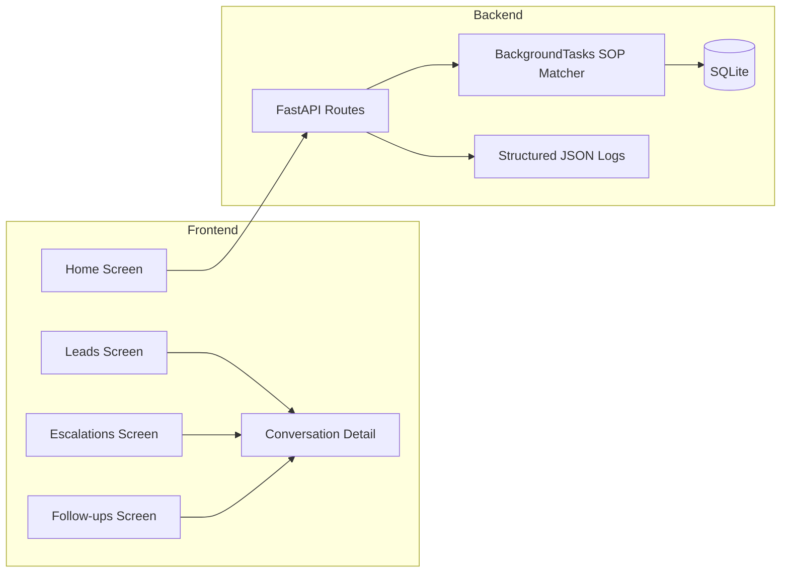

# Closira — Engineering Assignment Submission

Full-stack submission for the Closira / Breakout AI Engineering Internship. This repository contains a FastAPI backend that triages customer enquiries asynchronously and a React Native dashboard that lets a business owner monitor leads, escalations, and follow-ups from a phone. The goal is not just to show code that runs, but to show engineering judgment: clear APIs, explicit trade-offs, and a system shaped around Closira’s actual business workflow.

## Why This Matters

Closira helps SMBs manage customer enquiries across WhatsApp, email, and phone without letting important conversations slip through the cracks. This project models that workflow in a way that is intentionally simple to evaluate but still realistic:

- It accepts enquiries immediately and processes them asynchronously so the API stays responsive.
- It routes common cases to SOPs and escalates ambiguous or urgent ones to humans.
- It gives operators a mobile-first dashboard so they can act on leads and escalations quickly.
- It keeps the architecture small enough for an assignment, while still showing how it would scale into a production system.

In short, this is a working prototype of Closira’s core operational loop: capture enquiry, classify it, escalate when needed, and keep the team informed.

## Quick Start

### Prerequisites

- Python 3.11
- Node.js 18+
- Expo Go, iOS Simulator, or Android Emulator

### Backend

```bash
cd backend
python -m venv venv
venv\Scripts\activate  # Windows
# source venv/bin/activate  # macOS/Linux

cp .env.example .env
pip install -r requirements.txt
uvicorn app.main:app --reload
```

API: http://localhost:8000  
Docs: http://localhost:8000/docs

### Frontend

```bash
cd frontend
npm install
npm start
```

Use Expo Go on a device, or press `i` for iOS simulator and `a` for Android emulator.

### Test Suite

```bash
cd backend
pytest tests/ -v
```

Expected result: 24 passing tests.

### .env Example

The backend ships with an example environment file so setup is one step:

```env
DATABASE_URL=sqlite:///./closira.db
LOG_LEVEL=INFO
APP_ENV=development
DEBUG=True
```

## Repository Structure

```text
closira-assignment/
├── backend/
│   ├── app/
│   │   ├── api/          # FastAPI route handlers
│   │   ├── core/         # Config, database, logging
│   │   ├── db/           # Session and engine setup
│   │   ├── models/       # SQLAlchemy ORM models
│   │   ├── schemas/      # Pydantic request/response models
│   │   └── services/     # Business logic and SOP matching
│   ├── tests/            # 24 pytest tests
│   ├── requirements.txt
│   ├── docker-compose.yml
│   └── .env.example
├── frontend/
│   ├── src/
│   │   ├── screens/      # 5 app screens
│   │   ├── components/   # Reusable UI building blocks
│   │   ├── constants/    # Design tokens and app constants
│   │   └── navigation/   # Tab + stack navigation
│   ├── App.tsx
│   └── package.json
└── README.md
```

## Architecture Overview



The backend is intentionally small and explicit: routes only handle HTTP concerns, while the services layer owns business rules. The frontend uses mock data for the main screens so the UI stays deterministic during review, while the home screen performs a live backend health check to prove the API is reachable.

## Why These Decisions

### Backend

**Decision: FastAPI BackgroundTasks instead of Celery**

- Reasoning: SOP keyword matching is a very small in-process CPU task. It does not need retries, queues, or a worker fleet.
- Trade-off: BackgroundTasks are fire-and-forget, so a crash can drop in-flight work.
- Production path: If the task became slower or needed persistence, the same service logic could be moved to Celery with minimal changes.

**Decision: SQLite instead of PostgreSQL**

- Reasoning: SQLite gives evaluators a zero-setup path and keeps the assignment runnable from a clean machine.
- Trade-off: SQLite does not handle concurrent writes like Postgres, so it is not the right choice for a busy production system.
- Production path: SQLAlchemy keeps the swap cheap. Changing `DATABASE_URL` is enough for the current query patterns.

**Decision: JSON columns for timeline, follow-ups, and conversation history**

- Reasoning: These records are append-only and are always read with the parent enquiry.
- Trade-off: JSON is harder to query efficiently if you need analytics across those nested events.
- Production path: If reporting or filtering across those arrays became important, they should move into normalized child tables.

### Frontend

**Decision: StyleSheet with design tokens instead of NativeWind**

- Reasoning: The UI uses dynamic color values and TypeScript strict mode, both of which are more reliable with explicit StyleSheet objects.
- Trade-off: The code is a little more verbose than utility classes.
- Production path: The constants file already plays the role of a theme system, so expanding the design system later is straightforward.

**Decision: Mock data shaped like API payloads**

- Reasoning: The mock records mirror the backend schema, including IDs, timestamps, and nested arrays.
- Trade-off: The app is not fully wired to live backend data yet.
- Production path: Swapping imports for a small API service layer should not require changing component logic.

## API Reference

### POST /enquiry

Creates a new enquiry and immediately returns a job ID. SOP matching happens asynchronously in the background.

Request:

```json
{
    "customer_name": "Sarah M.",
    "message": "I want to book an appointment for next Tuesday",
    "channel": "whatsapp"
}
```

Response:

```json
{
    "job_id": "c38b97cf-e8a9-4f1c-8fbf-67b18b1a6b79",
    "status": "processing"
}
```

Common errors:

- `422` if `channel`, `customer_name`, or `message` is missing or invalid.

### POST /enquiry/{id}/follow-up

Schedules a follow-up for an enquiry.

Request:

```json
{
    "delay_minutes": 30,
    "message_template": "Following up regarding your enquiry"
}
```

Response:

```json
{
    "message": "Follow-up scheduled",
    "enquiry_id": "<id>",
    "follow_ups": []
}
```

Common errors:

- `404` if the enquiry does not exist.
- `422` if the delay is outside the allowed range or the enquiry cannot accept follow-ups.

### POST /enquiry/{id}/escalate

Marks an enquiry as escalated and stores a human-readable reason.

Request:

```json
{
    "reason": "Customer requested manager"
}
```

Response:

```json
{
    "message": "Enquiry escalated",
    "enquiry_id": "<id>",
    "status": "escalated",
    "reason": "Customer requested manager"
}
```

Common errors:

- `404` if the enquiry does not exist.
- `422` if the reason is missing or blank.

### GET /enquiry/{id}/history

Returns the full enquiry record, including conversation history, status timeline, follow-ups, and SOP metadata.

Response includes:

- `id`
- `job_id`
- `channel`
- `customer_name`
- `message`
- `status`
- `matched_sop`
- `suggested_response`
- `escalation_reason`
- `status_timeline`
- `follow_ups`
- `conversation_history`

Common errors:

- `404` if the enquiry does not exist.

### GET /health

Checks application and database health.

Response:

```json
{
    "status": "healthy",
    "database": "connected"
}
```

## SOP Matching Logic

The background worker uses keyword scoring across five SOP categories:

| SOP Category | Trigger Keywords |
|---|---|
| Booking Enquiry | book, appointment, schedule, reserve, slot, availability |
| Pricing Question | price, cost, how much, fee, quote, rate, package, plan |
| Complaint | complaint, unhappy, issue, problem, wrong, bad, refund |
| After-Hours Message | after hours, closed, weekend, holiday, late, early morning |
| Product Demo Request | demo, demonstration, trial, walkthrough, features, tour |

Scoring is simple: each keyword match adds one point. The highest score wins. If no SOP matches, the enquiry is auto-escalated to a human agent.

## Testing

### Backend

```bash
cd backend
pytest tests/ -v
```

Result in this workspace: 24/24 tests passing.

Coverage includes:

- API validation and error cases
- SOP matching behavior
- Background task flow
- Database create/update/history behavior
- Escalation and follow-up paths

### Manual Smoke Test

```bash
curl http://localhost:8000/health
curl -X POST http://localhost:8000/enquiry \
    -H "Content-Type: application/json" \
    -d '{"customer_name":"Test User","message":"I want to book an appointment","channel":"whatsapp"}'
```

### Frontend

The frontend does not yet have automated tests. Manual validation in this workspace confirmed that `npm start` launches Expo successfully from the frontend directory.

## Known Limitations

These are intentional trade-offs for assignment scope:

- No authentication or role-based access control.
- Background tasks are fire-and-forget; they are not persisted through crashes.
- Frontend state is in-memory only and resets on reload.
- No real-time push updates for new escalations.
- SOP matching is keyword-based rather than semantic.
- The main frontend screens still use mock data rather than live API calls.

## Future Improvements

If this were moving toward production, the next steps would be:

1. Add JWT authentication and tenant isolation.
2. Move background processing to Celery or a queue-backed worker.
3. Add live dashboard updates with WebSockets or Server-Sent Events.
4. Replace mock data with a typed frontend API layer.
5. Add integration tests that cover the full backend-to-frontend flow.

## Video Walkthrough

Add your demo video here:

- 2 to 5 minutes total
- Backend startup and Swagger tour
- Creating an enquiry and showing async SOP matching
- Frontend navigation walkthrough
- One architecture decision explained clearly

Example placeholder:

```text
https://your-video-link-here
```

## About This Submission

**Built by**: Yuga  
**GitHub**: github.com/yuga-i2  
**LinkedIn**: linkedin.com/in/yugashaji

**Context**: Assignment submission for the Closira / Breakout AI Engineering Internship  
**Timeline**: 48-hour build window  
**Tracks completed**: Backend and Frontend

The intent of this submission is to show more than a passing implementation: it shows product understanding, trade-off awareness, and the ability to build and explain a small system end to end.
